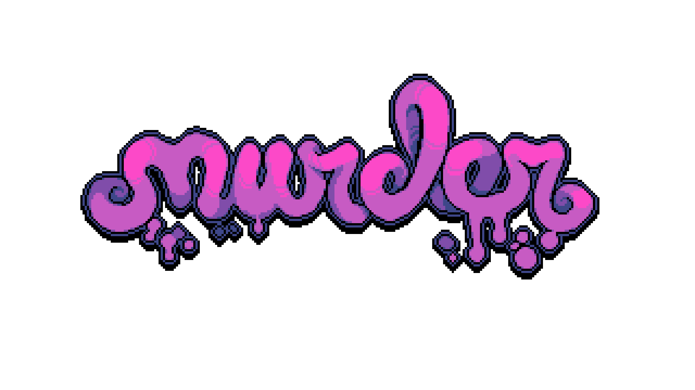
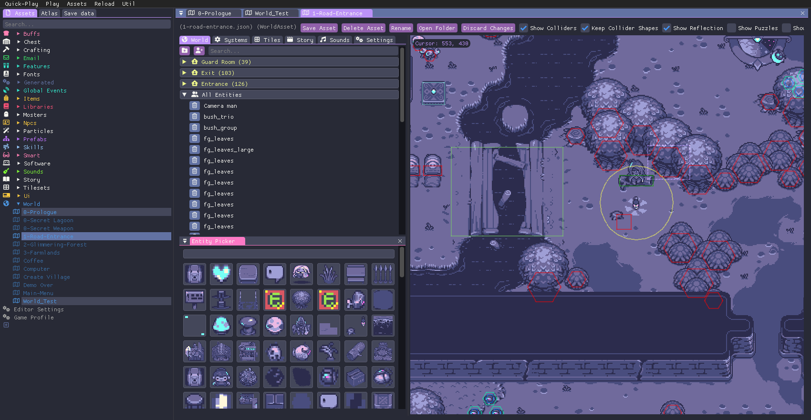
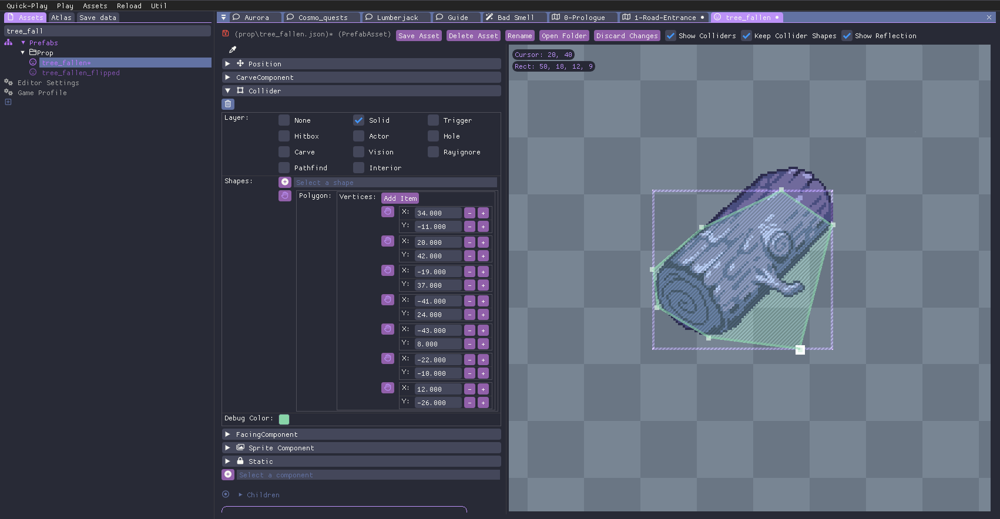
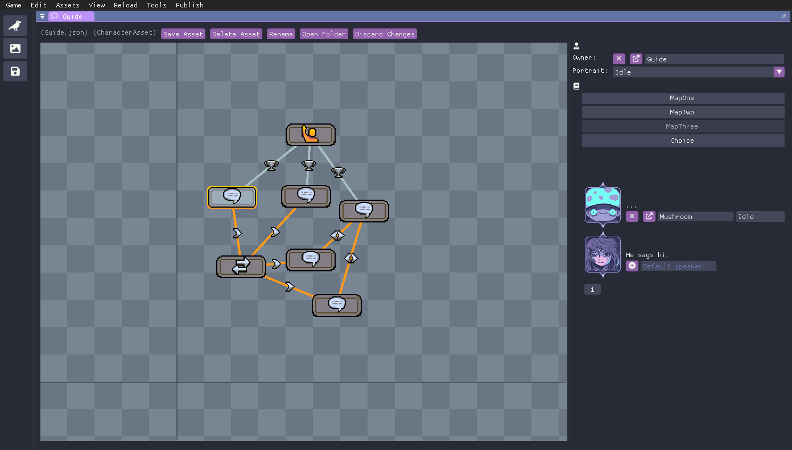

<p align="center">

</p>

<h1 align="center">Welcome to Murder Engine!</h1>

<h4 align="center">This is the source for Murder Engine, a pixel art ECS game engine built on top of FNA.</h4>

<p align="center">
<a href="https://github.com/isadorasophia/murder/actions/workflows/ci.yml"></a>
<a href="LICENSE"></a>
<a href="https://discord.gg/zF6axz9nQy"></a>
</p>

> 🚧👷 **Warning** Proceed at your own risk. This is an in-development engine, which is another way of saying that it will change _quite a lot_. We do our best to keep release branches stable, but expect a lot of breaking changes and things that are not perfect (yet!).

### How to build it?

If you're good at just digging examples and figuring things out, I recommend starting out with our [game jam project](https://github.com/isadorasophia/neocityexpress) or the [Hello World project](https://github.com/isadorasophia/hellomurder). These projects show what to expect from the Murder architecture and how to create a world, entities and components, which ECS is all about.

> ...I realize this is quite redundant because the Hello World references this repository as a documentation source, but hang with me.

This is what the architecture looks like:
```
└── root 
    └── resources
    └── src
        ├── game
        │   ├── bin (final game)
        │   ├── packed
        │   └── resources
        └── game.editor
            ├── bin (game editor)
            └── resources
```

You may notice that **there is no external editor.exe**, only your own project. This is so you can have full control of your project! Very similar of what you expect developing a [MonoGame](https://www.monogame.net/) or a [FNA](https://fna-xna.github.io/) project, for example.

The idea of a separate project for the editor is that editor code never touches your beautiful and efficient game code, and you can do whatever you want on the editor side.

There is no nuget package for Murder yet, so the recommended way is to keep a git submodule to reference in your .csproj, [see example](https://github.com/isadorasophia/hellomurder/blob/main/src/HelloMurder/HelloMurder.csproj).

For more information on how the ECS applies to the engine, I recommend checking out the documentation for [Bang](https://github.com/isadorasophia/bang), the framework that Murder uses.

### Requirements
We support developing (which means, running the editor) on **Linux, MacOS, Windows** and even **Steam Deck**. All you really need is .NET 8 SDK installed.

### Supported platforms
The engine supports targeting your game to Linux (which includes Steam Deck), MacOS and Windows. Console support is currently on progress. 

We have no plans on officially supporting web or mobile (iOS or Android) for now, sorry!

### Contributing
This is still super early, but feel free to contact me or [saint11](http://saint11.org/) if you have any suggestions. I am very interested in people trying it out and any feedback you may have!

### ✨ Editor examples
<p align="center">



</p>
