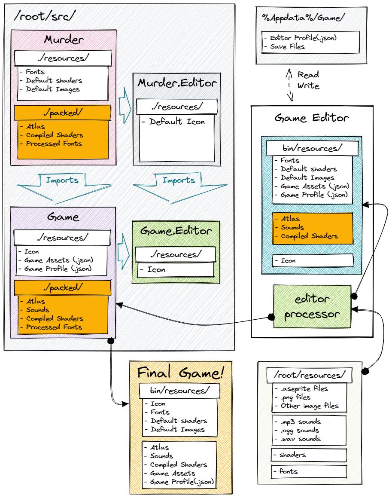

# Architecture
Let's do the architecture here... soon...

## File structure

In the meantime, here's an overview of how the file structure works in Murder. We did the following diagram to help with that: \



The idea is that the game inherits Murder engine, and the game can be built standalone regardless of an editor. This is what your game project should look like:

```csharp
└── root 
    └── resources
    └── src
        ├── game
        │   ├── bin (final game)
        │   ├── packed
        │   └── resources
        └── game.editor
            ├── bin (game editor)
            └── resources
```

The editor is there to facilicate creating assets and debugging the game itself. It manages the resource management, and will make sure that any assets
currently present in *root/resources* will be deployed into *src/game/resources* as the final assets.

Any new assets should be saved directly on *root/resources* and the editor will automatically pick that up.